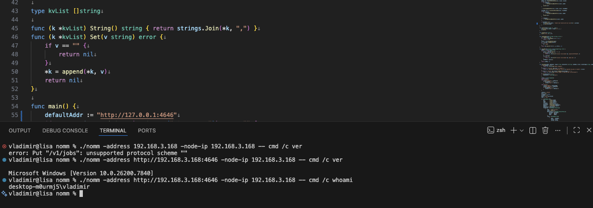

A tiny single-file Go client for **HashiCorp Nomad**: run one command as a short-lived batch job and get its exit code back locally.

# nomm

It:
- Registers a short-lived **batch** job in Nomad to run one command
- Streams task output best-effort and returns the task exit code locally
- Supports pinning placement to a specific client by IP (useful for Windows)
- Supports passing environment variables to the task



## Usage

```bash
./nomm \
  -address http://127.0.0.1:4646 \
  -datacenter dc1 \
  -environment FOO=bar \
  -environment BAZ=qux \
  sh -lc 'echo hello'

Windows client example (`raw_exec` on a Windows Nomad client at a specific IP):
./nomm \
  -address http://127.0.0.1:4646 \
  -node-ip 192.168.3.168 \
  -- \
  cmd /c ver
```

You can also set `NOMAD_ADDR` and `NOMAD_TOKEN` in the environment instead of passing `-address` / `-token`.

## Flags (high level)

Nomad connection:

- `-address`: Nomad address (default `http://127.0.0.1:4646`)
- `-token`: Nomad ACL token (optional)
- `-namespace`: Nomad namespace (optional)
- `-region`: Nomad region (optional)

TLS:

- `-tls-ca`: CA cert to trust (optional)
- `-tls-cert` / `-tls-key`: mTLS client cert + key (optional; must be provided together)
- `-tls-server-name`: TLS SNI override (optional)
- `-tls-insecure-skip-verify`: skip TLS hostname/SAN verification (insecure)

Job shape:

- `-datacenter`: datacenter (repeatable or comma-separated; defaults to `dc1`)
- `-driver`: `raw_exec` (default) or `docker`
- `-docker-image`: required when `-driver=docker`
- `-environment`: env var `KEY=VALUE` (repeatable)
- `-cpu`: CPU MHz (default `100`)
- `-memory`: memory MB (default `128`)

Lifecycle:

- `-timeout`: overall timeout for register → alloc completion (default `30m`)
- `-keep-job`: do not deregister job after completion
- `-dry-run`: print computed job info and exit without contacting Nomad
